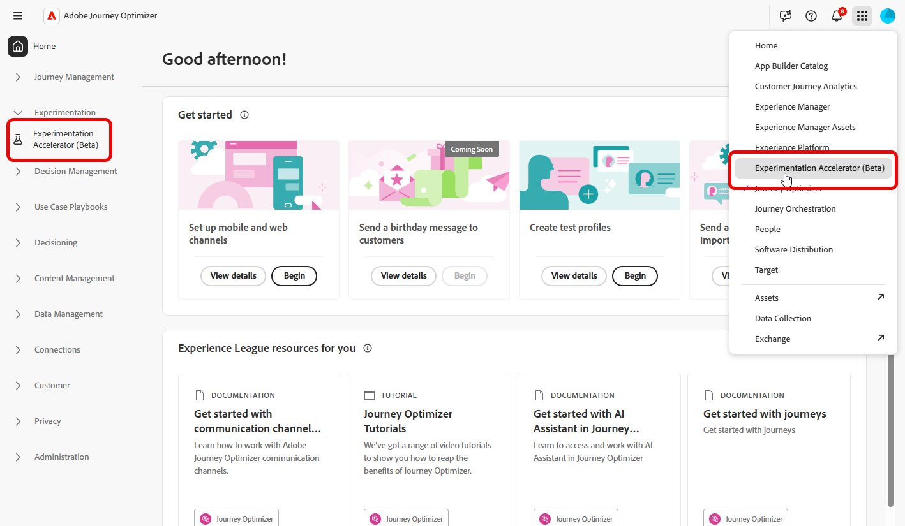

# Toegang tot Journey Optimizer Experimentation Accelerator

Na [&#x200B; het creëren van en het vormen van uw experiment &#x200B;](https://experienceleague.adobe.com/nl/docs/journey-optimizer/using/content-management/content-experiment/content-experiment) en het verzenden van uw campagnes of reizen naar uw profielen, kunt u tot **[!UICONTROL Journey Optimizer Experimentation Accelerator]** toegang hebben om dieper in te duiken hoe uw experiment uitvoert.

U kunt **[!UICONTROL Journey Optimizer Experimentation Accelerator]** openen vanuit het linkermenu vanuit de vervolgkeuzelijst [!UICONTROL Experimentation] of via de Apps-schakeloptie. Gebruikers met alleen een Target-licentie hebben er alleen toegang toe via de Apps-schakeloptie.

Welke experimenten beschikbaar zijn, is afhankelijk van uw instellingen:

* **voor de gebruikers van Adobe Journey Optimizer**: De opstelling van experimenten in uw toegelaten zandbak van de organisatie wordt automatisch omvat.

* **voor de gebruikers van Adobe Target met Journey Optimizer**: Om het even welke A/B activiteiten in Doel verschijnen in **[!UICONTROL Journey Optimizer Experimentation Accelerator]** in de productiesandbox van Journey Optimizer.

* **voor Adobe Target-slechts gebruikers**: Alle activiteiten A/B in uw organisatie van het Doel zijn inbegrepen in de productiesandbox van Journey Optimizer.

Als u **[!UICONTROL Journey Optimizer Experimentation Accelerator]** wilt gebruiken, hebt u toegang tot de sandbox en de volgende gerelateerde machtigingen nodig:

* **[!UICONTROL View Experiments]**
* **[!UICONTROL Manage Experiment Metada]**

+++ Leer hoe u aan Experimenten gerelateerde machtigingen kunt toewijzen

1. Ga in het **[!DNL Permissions]** -product naar de tab **[!UICONTROL Roles]** en selecteer de gewenste **[!UICONTROL Role]** .

1. Klik op **[!UICONTROL Edit]** om de machtigingen te wijzigen.

1. Voeg de **[!UICONTROL Experiment accelerator]** -bron toe en selecteer vervolgens **[!UICONTROL View Experiments]** en/of **[!UICONTROL Manage Experiment Metada]** in het keuzemenu.

   

1. Klik op **[!UICONTROL Save]** om wijzigingen toe te passen.

Voor alle gebruikers die al zijn toegewezen aan deze rol, worden hun machtigingen automatisch bijgewerkt.

Deze rol toewijzen aan nieuwe gebruikers:

1. Navigeer naar het tabblad **[!UICONTROL Users]** in het dashboard Rollen en klik op **[!UICONTROL Add User]** .

1. Voer de naam en het e-mailadres van de gebruiker in of kies een optie in de lijst en klik op **[!UICONTROL Save]** .

   Als de gebruiker niet eerder werd gecreeerd, verwijs naar [&#x200B; deze documentatie &#x200B;](https://experienceleague.adobe.com/nl/docs/experience-platform/access-control/abac/permissions-ui/users).

De gebruiker ontvangt een e-mail met instructies om toegang te krijgen tot uw exemplaar.

+++

<!--table style="table-layout:fixed"><tr style="border: 0;">
<td>

<strong><a href="experiment-accelerator-overview.md">Overview</a></strong>

</td>
<td>

<strong><a href="experiment-accelerator-monitor.md">Experiments</a></strong>

</td>
<td>

<strong><a href="experiment-accelerator-metrics.md">Metrics</a></strong>

</td>
</tr></table-->
